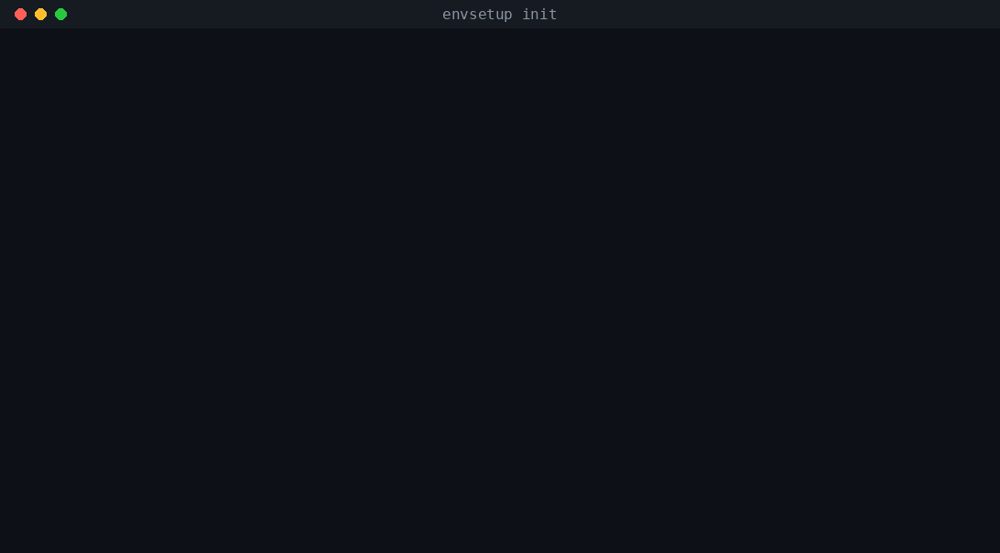

# envsetup.dev 🚀

**Standardize your development environments with AI-powered orchestration.**

`envsetup.dev` replaces manual, error-prone `setup.sh` scripts and inconsistent Docker configs with a powerful, modern CLI and an AI-driven platform.

[](https://v0.app/chat/fSuP1nkcamn)
[](https://www.npmjs.com/package/@envsetup/cli)



## 🌟 Key Features

- **Standardized Environments**: Generate production-ready Docker setups for any stack (Next.js, FastAPI, Go, Express).
- **Interactive Wizard**: A beautiful, modern CLI experience to initialize your projects in seconds.
- **AI Recommendation Engine**: (Coming Soon) Let AI find the perfect tools and versions for your specific project needs.
- **Unified Orchestration**: Manage your entire project lifecycle (Dev, Sync, Deploy) through a single tool.

---

## 🛠️ Getting Started with the CLI

The core of `envsetup.dev` is our CLI. No install needed — just run it:

```bash
npx @envsetup/cli init
```

Prefer it installed globally?

```bash
npm install -g @envsetup/cli
envsetup init
```

---

## 📁 Project Structure

- `/app`: The web platform (Next.js 15) for managing architectures and analytics.
- `/components`: Premium UI components powered by Tailwind CSS and Framer Motion.
- `/cli`: The source code for the `@envsetup/cli` tool.
- `/lib`: Shared utilities and database logic.

---

## 🚀 Roadmap

- [x] CLI Foundation & Interactive Wizard
- [x] Presentation & Strategy Deck
- [x] **Phase 2**: Expanded Framework Templates (Java, Ruby, Rust, and 20+ more languages)
- [x] **Phase 3**: `envsetup doctor` for local system health checks
- [ ] **Phase 4**: MCP (Model Context Protocol) Server for AI Agent integration *(in progress — see `/mcp-server`)*

---

Built with ❤️ by the envsetup.dev team.
